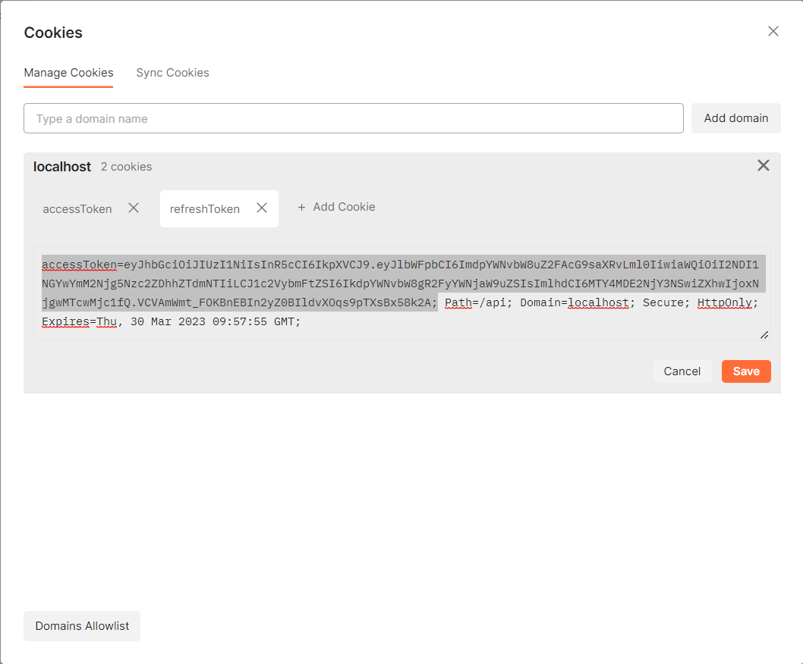

# How to run the code

You have the option to run the code either locally or inside a Docker container. However, please 
note that the project will be evaluated based on its functionality when executed inside a Docker 
container.

While you are free to execute the code locally during development, we kindly ask you to ensure that 
it works correctly within a Docker container before submitting your project. Any malfunctioning code 
that only works locally will result in a penalty during the evaluation process.

## Running the code locally

You need to install [Node.js](https://nodejs.org/en/download) and 
[MongoDB](https://www.mongodb.com/try/download/community-edition) and then execute `npm install` on 
the command line. This command will install all the dependencies required by the project. Then, you 
can execute `npm start`. This command will make the Node.js backend available on the port 3000. You 
can 
call the endpoints by using [Postman](https://www.postman.com/).

You can also run the tests by executing `npm test` or `npm run test:coverage`.

All the npm commands must be run by using the terminal opened in the root project folder called 
`code` (this folder).

### Calling the endpoints with Postman
In the Postman you can test the calls to the different endpoints by specifying the route, its 
parameters and the content of the body as shown in the upper section of the picture below, while the 
content of the response body appears in the lower section.

After performing login with the corresponding endpoint call you are able to see the cookies set for 
authentication by clicking on the `Cookies` button in the upper section of the screen; this will 
open up the menu shown below, where you can see the cookies set for the `localhost` domain.

To use cookies set after login in subsequent endpoint calls, you have to manually copy them to the 
`Headers` section of the page, in the format shown below. This will set the cookies to the calls you 
make after login and allow you to access routes that require authentication. You must always 
remember to change the values set in the `Headers` section after a token you are using changes 
value, or you will not be able to access routes anymore.

## Running the project on Docker

Before starting the process described below, download [Docker 
Desktop](https://www.docker.com/products/docker-desktop/).

- Start Docker Desktop.
- Execute `docker compose build` from a terminal to create a container with the three images 
(Node.js app, MongoDB server, Node test suite).
- Execute `docker compose -p ezwallet up` from a terminal to launch the container.
- On `Docker Desktop -> Containers`, locate the container ezwallet. It should contain three separate 
images (`db-1`, `app-1`, `test-1`).
- test-1 ends after completing the test cases directly on the terminal. Its logs can be seen on 
`Docker Desktop -> Containers -> ezwallet-test-1 -> Logs`.
- app-1 is the container that holds the Node.js application and makes it accessible on 
`localhost:3000`. It is possible to access the various routes using Postman or other tools.
- To test changes in the code directly on Docker, all the images present in the container on Docker 
Desktop must be stopped before executing docker compose build and docker compose up again.
- The two commands must be launched together in this exact order after code changes, or the images 
will not be built with the new code.
- Ensure that ports `27017` and 3000 are free before executing `docker compose -p ezwallet up` by 
using the command `docker ps`.
